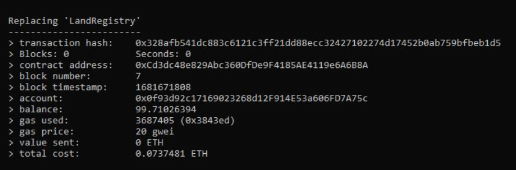

# Land Registration System Using Blockchain


## Table of Contents

- [About](#About)
   - [Drawbacks of traditional system](#how-it-works)
   - [How it works](#drawbacks-of-the-traditional-system)
- [Tech Stack & Tools](#tech-stack--tools)
- [Installation](#installation)
- [Usage](#usage)


# About

The Land Registration System Using Blockchain is a decentralized application (DApp) built on the Ethereum blockchain. 
It aims to revolutionize the traditional land registration process by leveraging blockchain technology. 

### Drawbacks of the traditional system
 
   *  Traditional system prone to fraud and manipulation.   
   *  Slow and cumbersome process for property tranfer.
   *  Manual paperwork leads to inefficiencies and delays.
   *  Lack of transparency in property ownership records.     
   *  Involvment of third parties in the process of purchase increases the costs.
   *  Difficulty in resolving disputes due to centralized control.
   *  Risk of data loss or corruption in centralized databases.

By usig the blockchain technology, we can avoid all the drawbacks of the traditional system. As blockchain is an immutable and decentralized ledger, all the transactions that happended through the blockchain are transparent, unalterable, and secure. <br>
So, No one can get the false ownership by altering the data, and transferrig the ownership of the property from one person to another person can be done without involvement of any third parties and government in a secure, transparent, and within no time.


### How it works ?

This project contains mainly two steps:

1. **Decentralizing Land Registry data**:
   
   - In order to leverage blockchain technology to avoid drawbacks of the traditional system, we first need to decentrailze the property ownership data that is held by their respective government.
   
    - To decentralize the data, we have provided an option in the portal to the user for uploading their property details & documents as a proof to identify the ownership of the user.

    - Once the user has uploaded their documents, they should be verified by the respective government officer.
   
   - After the verification process is completed, if he/she is the legal owner of the property then officer will grants the ownership to the user or else they will reject it.

   - Once, after the approval of ownership, the property details & it's ownership details  will be stored in the blockchain.

   - Later, user can buy or sell a property from or to a person without involvment of any middlemen or any other problems of the traditional system that slows down the process.

2. **Ownership Transfer System**:
   - In order to sell the property to another person, user will **log into the land registry portal** using their credentials, there all the properties of the user are listed.

   - If the user wants to sell a particural property they can **make the property as available to sell for the price they wanted**.

   - Once, the user make their property available to sell, it is listed in a public page where **any interested buyer can send the purchase request to the owner with the price they want to offer**.

   - Owner can view all the purchase requests received to a particual property and **can accept the purchase request of a buyer**.

   - Later, buyer can **transfer the agreed payment amount** to the seller.

   - After the successfull payment transfer, the **ownership of the propery will be transferred** from the seller to the buyer.


## Tech Stack & Tools
```
* Flask==2.2.3 
* MongoDB
* Solidity
* Ethereum Blockchain
* Truffle
* Ganache
* Metamask
```

## Installation

> The following installation commands are for Ubuntu 20.04.

1. Clone the repository:

   ```
   git clone <repo url>
   ```


2. Install [Ganache](https://trufflesuite.com/ganache/).

3. Install [MongoDB](https://www.mongodb.com/docs/manual/tutorial/install-mongodb-on-ubuntu/) & Run it.

4. Add [Metamask](https://metamask.io/download/) to your browser

5. Deploy Smart Contracts
   
   5.1 Open the Ganache & Create a local Ethereum block chain.

   5.2 Navigate to `Smart_contracts` folder and open `truffle-config.js` file.

   5.3 Set Ganache server configuration

   ```
   module.exports = {

      networks: {
      
         development: {
            host: "<Host address on which ganache running>",  // Default: localhost
            port: <Port on which ganache running>,            // Default: 7545
            network_id: "*",      
         },
      }
   }          
   ```

   5.4 Compile & deploy the contracts to block chaing
   ```
   cd Smart_contracts/
   ```
   ```
   truffle migrate
   ```
   
   > Note down `account` used for deploying, which looks similar to the following.

   
6. Install dependencies:
   
   6.1 Create python's virtual environment
   ```
   python3 -m venv <env_name>
   ```
   
   6.2 Activate the virtual environment
   ```
   source <env_name>/bin/activate
   ```

   6.3 Install Required libraries
   ```
   pip install -r python_package_requirements.txt
   ```

7. Deploy the Sever for Govt portal

   7.1 Navigate to `Server_For_Revenue_Dept` folder
   ```
   cd Server_For_Revenue_Dept/
   ```

   7.2 Open config.json file & Set the configuration with nano or text editor.
   ```
   {

      "Ganache_Url" : "<Ganache RPC Server URL>",  // default: http://127.0.0.1:7545

      "NETWORK_CHAIN_ID": <Ganache Network ID>,    // default: 5777

      "Mongo_Db_Url": "MongoDB Server URL"        //  default: mongodb://localhost:27017

      "Secret_Key": "<Set Random Security Key for flask server>",

      "Address_Used_To_Deploy_Contract": "<Account used to deploy the contracts>",

      "Admin_Password": "<Password for higher govt authority>" // default: 12345678
   }
   ```

   7.3 Activate the virtual environment you created in a separate terminal
   ```
   source <env_name>/bin/activate
   ```

   7.4 Run the flask server
   ```
   python3 app.py
   ```

8. Deploy the Server for User portal

   8.1 Activate the virtual environment you created in a separate terminal
   ```
   source <env_name>/bin/activate
   ```

   8.2 Navigate to `Server_For_Users` folder
   ```
   cd Server_For_Users/
   ```


   8.3 Run the flask server
   ```
   python3 app.py
   ```


## Usage

**Demo Video:**   <br>      
<video width="800px" height="400px" controls="controls">
<source src="readme_assests/Land_Registration_System_Using_Ethereum_Blockchain.wmv" type="video/mp4" />
</video>


**Screen shorts:** <br>
  
  
  
  
  
  
  
  
  
  
  

